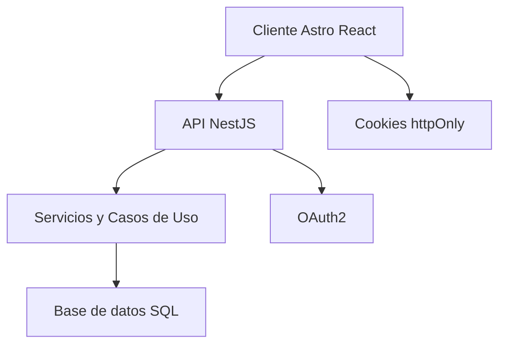
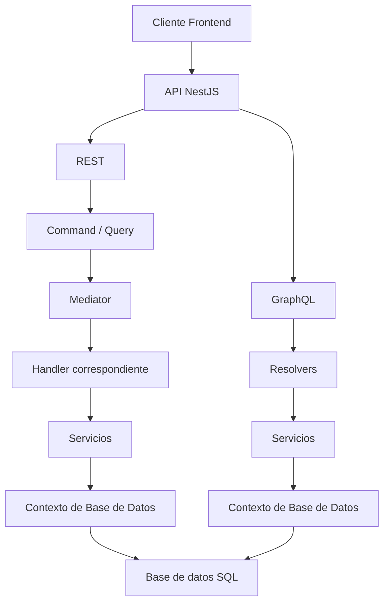

<!-- README con identidad DevTalles usando material gráfico de /.assets (sin guías de uso) -->

<div align="center">

  
  <br/>
  

  <h1>Code Quest 2025 — Blog Comunitario</h1>
  <p>Un blog comunitario, rápido y accesible, con UI cuidada y base técnica lista para crecer.</p>

  <a href="https://roquejohanssen.atlassian.net/jira/software/projects/OD/boards/3">
    
  </a>
  &nbsp;
  <a href="https://www.figma.com/design/UX4HwSBck2NOO36krAuzad/OPTARYS--DEVTALLES?node-id=2-33&t=DMUJ9IYllcsXAstD-1">
    
  </a>
  &nbsp;
  
  
  <a href="#-licencia"></a>

</div>

<p align="center">
  
</p>

## 📌 Enlaces rápidos

- 🧭 **Jira (Backlog/Board)** → https://roquejohanssen.atlassian.net/jira/software/projects/OD/boards/3  
  <sub>Requiere iniciar sesión con Atlassian.</sub>
- 🎨 **Figma (Diseño UI)** → https://www.figma.com/design/UX4HwSBck2NOO36krAuzad/OPTARYS--DEVTALLES?node-id=2-33&t=DMUJ9IYllcsXAstD-1
- 📄 **Backlog exportado (CSV)** → [docs/jira_backlog_codequest2025.csv](./docs/jira_backlog_codequest2025.csv)

<p align="center">
  
</p>

## 🎯 Objetivo

- **Landing** con listado de posts, filtros por categoría y buscador.  
- **Detalle de post** con likes y comentarios autenticados.  
- **Autenticación** vía **Discord OAuth2** (sesiones seguras).  
- **Panel administrativo** (UI) para CRUD de publicaciones.  
- **UX responsiva** y accesible con buen rendimiento.

## 🧰 Stack Tecnológico

- 💻 **Frontend**: Astro + React (islas), TypeScript, TailwindCSS, Flowbite React. → [blog-community-web](https://github.com/Optarys/devtalles-blog-community-web)
- 🏗️ **Backend**: NestJS (TypeScript), REST ,GraphQL, PostgreSQL y TypeORM. → [blog-community-api](https://github.com/Optarys/devtalles-blog-community-api)

<p align="center">
  
</p>

## 🏗️ Arquitectura & módulos



**Backend**: `auth`, `users`, `posts`, `comments`, `likes`, `categories`  
**Frontend**: `components/`, `pages/`, `content/`, `lib/`, `styles/`

## 🗂️ Repos/Estructura

```
blog-community-web/      # Frontend (Astro/React)
└─ src/
   ├─ components/
   ├─ pages/
   ├─ lib/
   ├─ styles/
   └─ env.d.ts
```

```
blog-community-api/      # Backend (NestJS)
└─ src/
   ├─ admin/ (Funciones administrativas)
   ├─ auth/ (Funciones de autenticacion)
   ├─ blog/ (Funciones de blog: publicaciones, comentarios, etc)
   ├─ core/ (Servicios, clases y modulos compartidos)
   ├─ database/ (Migraciones)
   └─ main.ts
```



<p align="center">
  
</p>

## 🔐 Variables de entorno

**Backend**
```
# CORS
CORS_ALLOWED_HEADERS=Content-Type,Authorization
CORS_CREDENTIALS=true
CORS_METHODS=GET,POST,PUT,DELETE,OPTIONS
CORS_ORIGINS=http://localhost:3000,https://tu-frontend-dev,https://tu-frontend-prod,http://localhost:4321

# Base de datos
DB_HOST=localhost
DB_NAME=blog_db
DB_USER=postgres
DB_PASS=postgres123
DB_PORT=5432

# OAuth2 - Discord
DISCORD_CLIENT_ID=DISCORD_CLIENT_ID_AQUI
DISCORD_CLIENT_SECRET=DISCORD_CLIENT_SECRET_AQUI
DISCORD_REDIRECT_URI=https://tudominio.com/auth/oauth2/callback

# OAuth2 - GitHub
GITHUB_CLIENT_ID=GITHUB_CLIENT_ID_AQUI
GITHUB_CLIENT_SECRET=GITHUB_CLIENT_SECRET_AQUI
GITHUB_REDIRECT_URI=https://tudominio.com/auth/oauth2/callback

# OAuth2 - Google
GOOGLE_OAUTH_CLIENT_ID=GOOGLE_CLIENT_ID_AQUI
GOOGLE_OAUTH_CLIENT_SECRET=GOOGLE_CLIENT_SECRET_AQUI
GOOGLE_OAUTH_REDIRECT_URI=https://tudominio.com/auth/oauth2/callback

# JWT
JWT_SECRET=JWT_SECRET_AQUI
JWT_EXPIRATION_TIME=1h

# Servidor
PORT=3000
TZ=America/Managua
```

**Frontend**
```
PUBLIC_API_BASE_URL=http://localhost:3000
PUBLIC_DISCORD_LOGIN_URL=http://localhost:3000/auth/discord
```

<p align="center">
  
</p>

## 🛠 CI/CD (sugerido)

```yaml
name: CI
on: [pull_request, push]
jobs:
  build:
    runs-on: ubuntu-latest
    steps:
      - uses: actions/checkout@v4
      - uses: actions/setup-node@v4
        with:
          node-version: 20
      - run: pnpm i --frozen-lockfile
      - run: pnpm -r lint && pnpm -r test && pnpm -r build
```

## 📜 Licencia

Este proyecto se distribuye bajo licencia **MIT**.

<p align="center">
  
</p>
